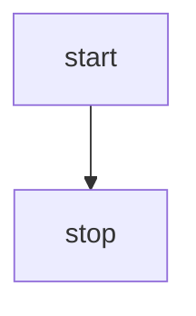
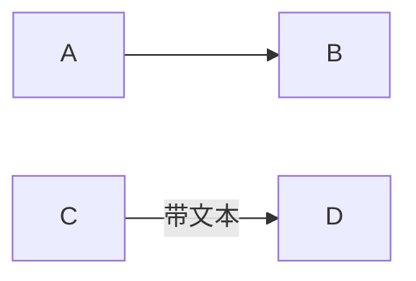
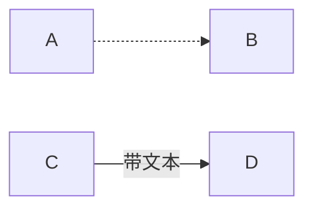
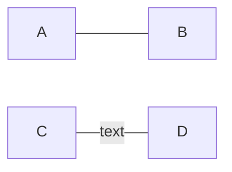
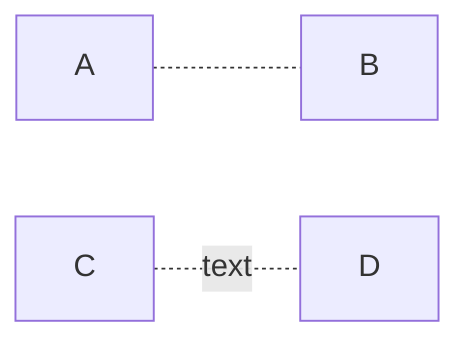
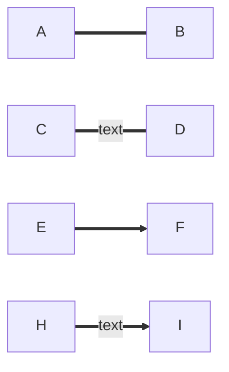
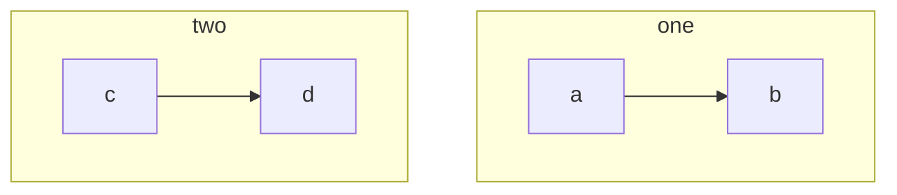
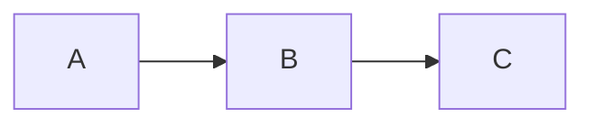

##### 前言

上一篇文章讲了 markdown 中的流程图，由于那个主要是黑色，可能不美观，这一篇文章介绍 markdown 中使用 mermaid 流程图。

**使用**
代码


效果



graph 表示使用流程图 TB 表示流程图方向(可选值如下)

| 值  | 说明   |
| --- | ------ |
| TD  | 上到下 |
| TB  | 上到下 |
| BT  | 下到上 |
| LR  | 左到右 |
| RL  | 右到左 |

**定义元素**

由于 markdown 不是支持所有的 mermaid 元素，所以这里只介绍部分，具体的可以参考[mermaid 文档](https://mermaid-js.github.io/mermaid/#/flowchart?id=flowcharts)

代码

展示


_注意：与之前不同，mermaid 元素定义了就会展示，同时，id 不能使用'end'关键字，大小写都不行_

**连线**

-   实线

```
graph LR
A --> B
C --> |带文本|D
```



-   虚线

```
graph LR
A --> B
C --> |带文本|D
```



-   实线不带箭头

```
   graph LR
   A --- B
   C --- |text| D
```



-   虚线不带箭头

```
   graph LR
   A -.- B
   C -.- |text| D
```



-   粗线

```
   graph LR
   A === B
   C === |text| D
   E ==> F
   H ==> |text| I
```



-   子模块

子模块使用 subgraph 关键字来定义

```
   graph TB
   subgraph one
   a --> b
   end
   subgraph two
   b --> c
   c --> d

```



-   定义元素点击事件

```
graph LR
A-->B
B-->C
click A "http://www.github.com"
click B "http://www.baidu.com"
click C callback "Tooltip"
```



_注意：不同解析引擎不一定能解析所有语言，比如 hexo 的 mermaid 插件与 tyora 的引擎解析的语法不一样，具体根据实际情况来使用，这些引擎都不能完全解析 mermaid 的全部语法。_
_callback 是一个回调函数，如果在浏览器渲染，比如 hexo，需要自己在全局注册这个回调函数。_

-   自定义样式

```
graph LR
A(Start) --> B(Stop)
style A fill:#f9f,stroke:#333,stroke-width:4px
style B fill:#bbf,stroke:#f66,stroke-width:2px,color:#fff,stroke-dasharray: 5 5
```


##### 总结

相比较 markdown 的原始流程图，mermaid 的样式更加好看，不可具体使用得根据自己不同环境而确定，不同的引擎实现解析语法不同。
