**什么是时序图**

> 时序图（Sequence Diagram），亦称为序列图、循序图或顺序图，时序图描述系统中类和类之间的交互, 将这些交互建模成消息交换, 时序图描述了类以及类之间的交换以完成的期望行为的消息, 时序图中每条消息都代表了类的一个操作 或者 引起状态机改变的触发事件。

**作用**

> 展示对象之间交互的顺序。将交互行为建模为消息传递，通过描述消息是如何在对象间发送和接收的来动态展示对象之间的交互；相对于其他 UML 图，时序图更强调交互的时间顺序；可以直观的描述并发进程。

**markdown 中使用时序图**
与 meraid 流程图一样，大部分 markdown 引擎也支持 mermaid 时序图。

简单使用

```
sequenceDiagram
participant Tom
participant Jack

Tom --> Jack: what's your name?
Jack --> Tom: i'm Jack.

```

效果

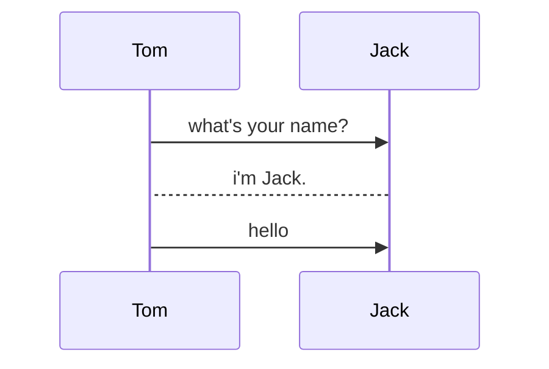

**语法**

-   `title` 定义标题

-   `participant` 用来定义对象

```
sequenceDiagram
participant Tom
participant Jack
```

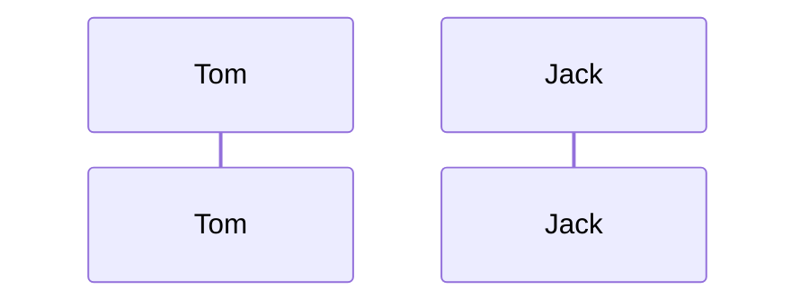

-   使用 `as` 关键字来给对象指定别名

```
sequenceDiagram
participant A as Tom
participant B as Jack
```

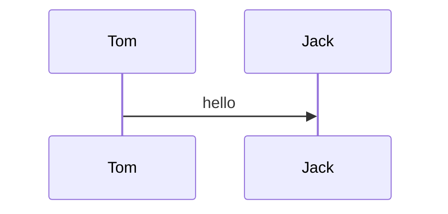

-   连线类型

    | Type | Description         |
    | ---- | ------------------- |
    | ->   | 不带箭头的实线      |
    | -->  | 不带箭头的虚线      |
    | ->>  | 带箭头实线          |
    | -->> | 带箭头虚线          |
    | -x   | 带 x 的实线 (async) |
    | --x  | 带 x 的虚线 (async) |

代码

```
sequenceDiagram
participant A as Tom
participant B as Jack
A -> B: 不带箭头实线
A ->> B: 箭头实线
A --> B: 不带箭头虚线
A -->> B: 箭头虚线
A -x B: x实线
A --x B: x虚线
```

效果

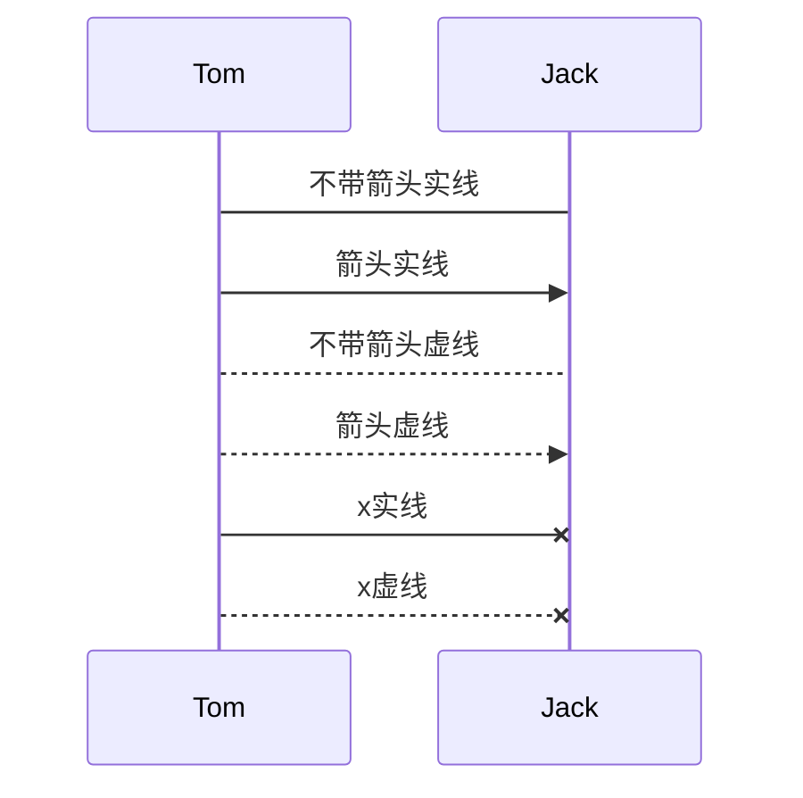

-   激活状态 `activate` 与 `deactivate` 关键字

```
sequenceDiagram
participant A as Tom
participant B as Jack

A ->> B: hello
activate B
B ->> A: great!
deactivate B
```

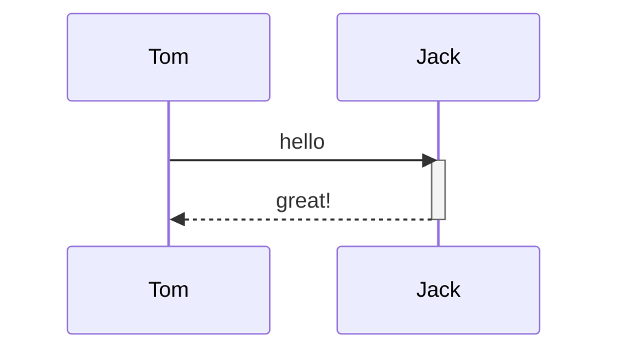

使用`+`和`-`表示激活态

```
sequenceDiagram
Alice->>+John: Hello John, how are you?
Alice->>+John: John, can you hear me?
John-->>-Alice: Hi Alice, I can hear you!
John-->>-Alice: I feel great!
```

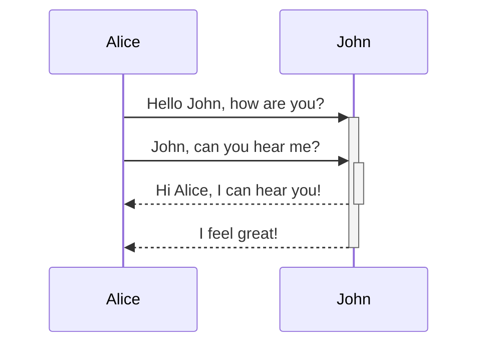

-   注释`Note`关键字

语法：
Note left\/right of Actor: message

```
sequenceDiagram
participant A as Tom
participant B as Jack
A ->> B: some thing
Note right of A: 注释文字

```

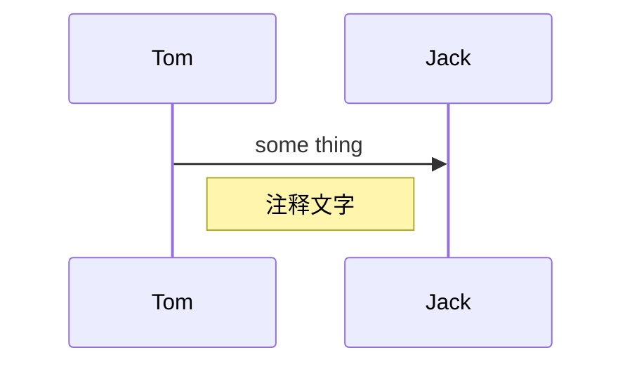

-   `loop`循环，使用`end`关键字指定循环范围

```
sequenceDiagram
participant A as Tom
participant B as Jack
loop 循环体
A ->> B: some thing
B -->>A: yes
end
```

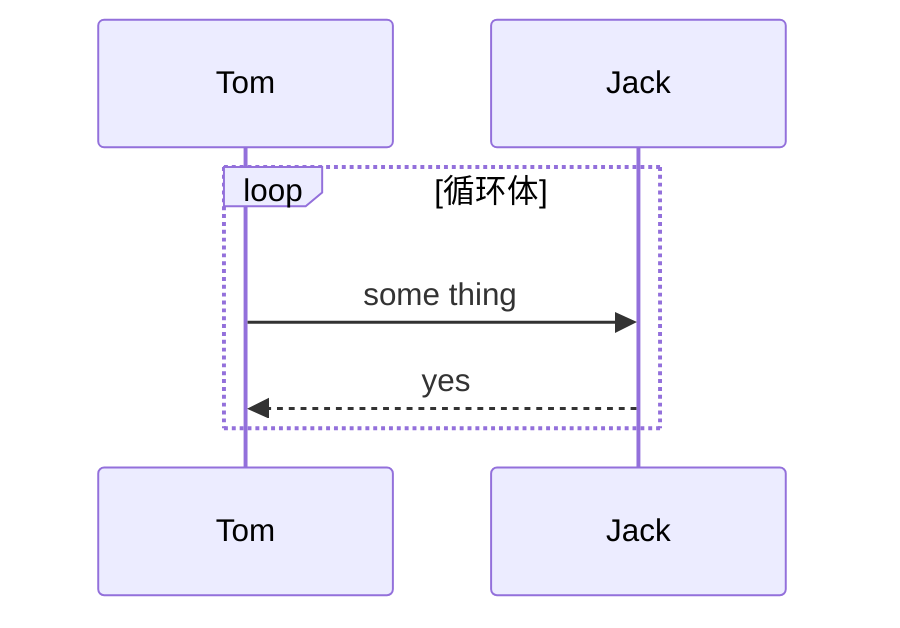

-   `alt`和`opt`关键字，条件判断，alt 用于多个分支，opt 表示只有一个分支

```
sequenceDiagram
Alice->>Bob: Hello Bob, how are you?
alt is sick
    Bob->>Alice: Not so good :(
else is well
    Bob->>Alice: Feeling fresh like a daisy
end
opt Extra response
    Bob->>Alice: Thanks for asking
end
```

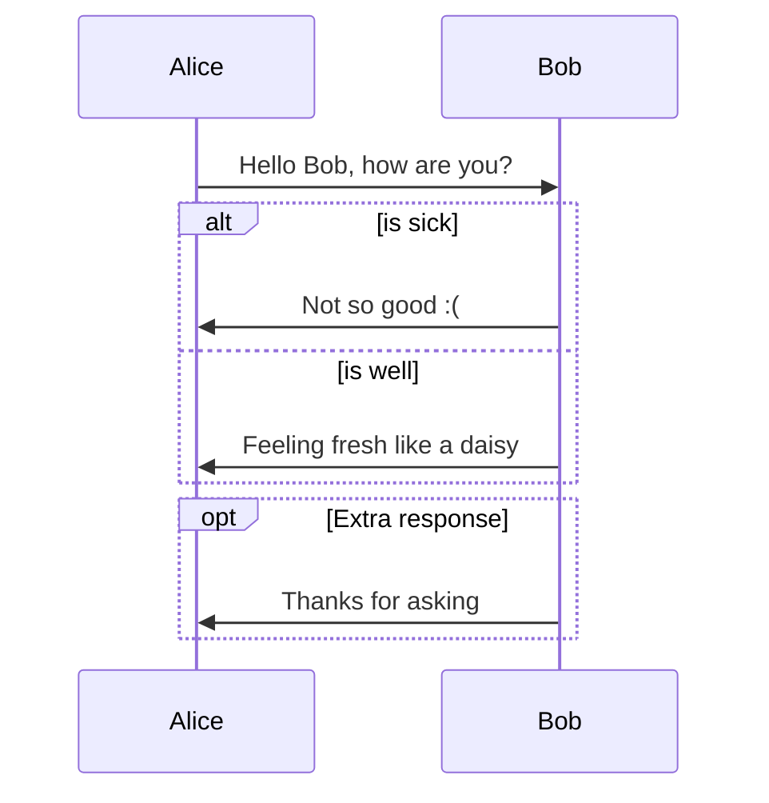

-   `par and`并行(Parallel)

```
sequenceDiagram
participant A
participant B
participant C
par 并行
    A ->> B: text
and
    A ->> C: text
end
```

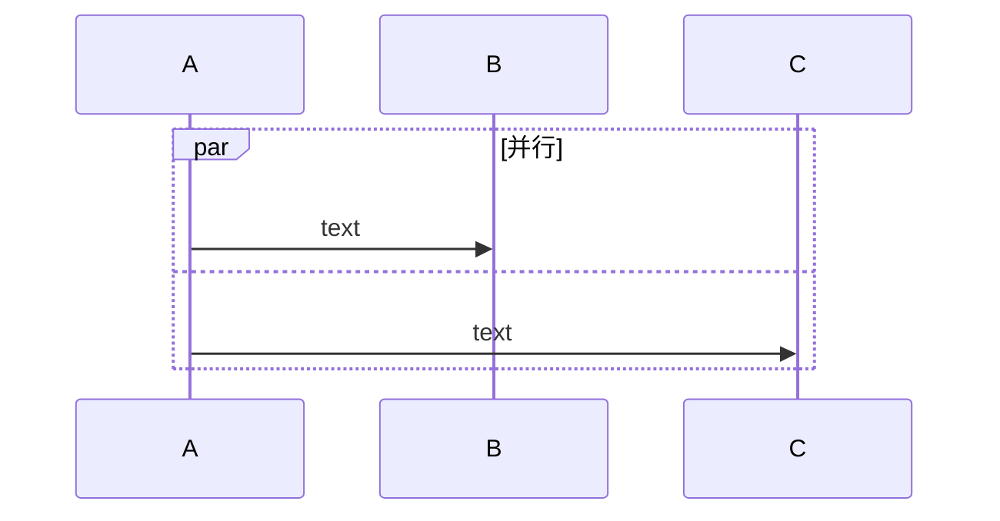

_循环，条件判断，并行语句是可以相互嵌套的_

-   `rect`指定背景颜色

```
    sequenceDiagram
    participant A
    participant B
    participant C

    rect rgb(0, 0, 255)
        par 并行
            A ->> B: text
        and
            A ->> C: text
        end
    end
```


_hexo 插件无法解析背景色_

##### 一个例子

代码

```
sequenceDiagram
title: 文件上传时序图
participant A as 用户
participant B as 文件队列
participant C as 控制器
participant D as CRC模块
participant E as 服务器
A->>C:选择文件
activate C
activate C
C->>C:初始化
deactivate C
C->>B:加入队列
deactivate C
Note left of C: 将文件加入队列
B->>C: 返回文件队列
loop 文件队列
    activate C
    alt 上传数是否小于3?
        par 上传文件
            C->>E:上传请求
            E-->>C:响应
            alt crc计算完成?
                C->>E:校验文件请求
                E->>C:返回校验结果
                C->>A:提示用户
            else
                C->>C:设置文件id
            end
        and 计算crc32
            C->>D:crc32
            D-->>C:计算完成crc32
            alt 文件是否上传完成?
                C->>E:校验文件请求
                E->>C:返回校验结果
                C->>A:提示用户
            else
                C->>C:设置文件crc
            end
        end
    else
        C->>C:终止循环
    end
    deactivate C
end
```

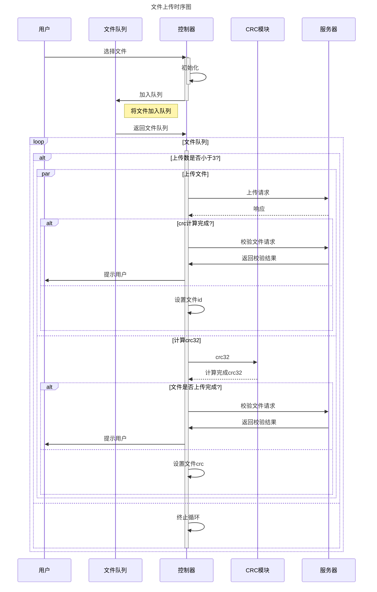
